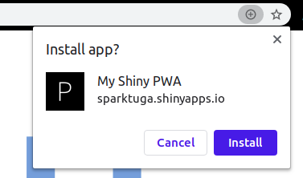
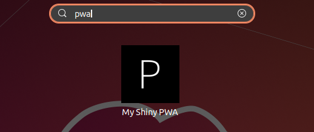
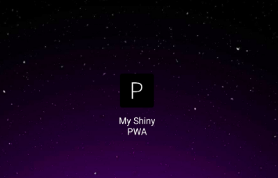

# shiny.pwa
Bring the power of Progressive web apps into your shiny dashboards!

# Usage
 - 1 - Install the package from github:
```R
devtools::install_github('pedrocoutinhosilva/shiny.pwa')
```

 - 2 - Include the library into your project:
```R
# global.R
library(shiny.pwa)
```

 - 3 - Call the `supportPWA` function in your UI definition, in any place you could add ui elements (for example `mainPanel` in a `fluidPage`):
```R
# ui.R
ui <- fluidPage(
  titlePanel("Hello Shiny!"),

  sidebarLayout(

    sidebarPanel(...),

    mainPanel(
      supportPWA("https://myapp.com"),
      ...
    )
  )
)
```
The following options are available:
- **base_url** the base URL where the app is hosted
- **title** The title of your Shiny app
- **location** subdirectory where the app is hosted. Only required if the app is not on the root domain.
- **icon** Icon to be used for the app. Should be 512x512 and saved under `www/pwa/offline.html`. A default icon is provided.
- **color** Color for the app. Used when the app is installed to color the minified browser elements.
- **use_offline_template** Should the default offine template be used. Your own template can be created under `www/pwa/offline.html`
- **offline_message** When using the default offline page template, can be used to change the displayed message.
```
NOTE: While base_url is the only required argument, location is VERY important if
when your app is hosted in a subdirectory.
```

 - 4 - Thats it!

# Using PWAs
User experience depends on the OS and browser.

### Desktop
On desktop (Unix and Windows) you can use chrome to install the PWA as a standalone application. This can be done via the install button on the address bar:



It will then be available in standalone mode and show as a normal installed application:



### Mobile
On mobile you can use chrome, firefox or safari to install the PWA. On the first visit you will see a prompt for installation, on the following visits each browser has its own standards, for example chrome has the option available under "Add to home" in the right top corner options menu, firefox displays a `+` button on the address bar.


After installing the app will show and behave on your home screen as a normal mobile application.

